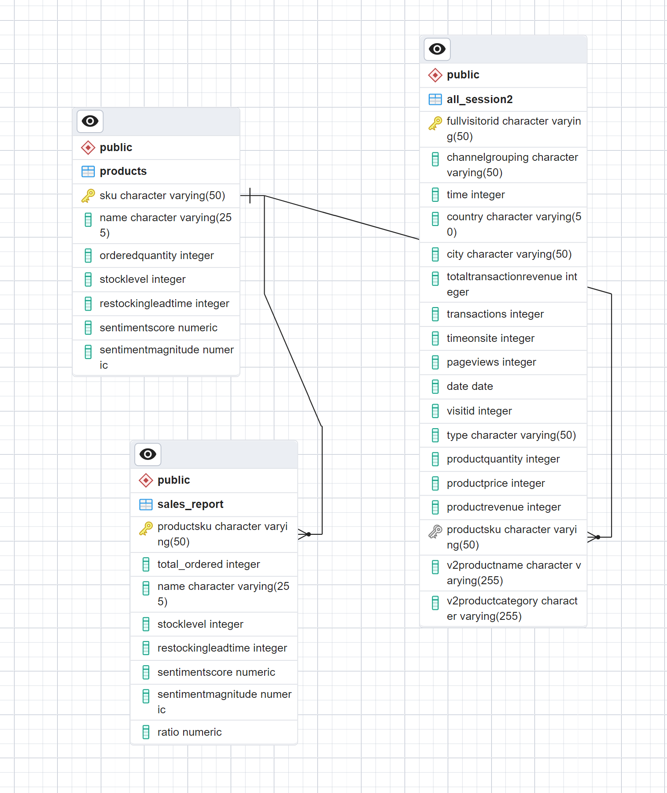

# Final-Project-Transforming-and-Analyzing-Data-with-SQL

## Project/Goals
My project goal is to clean up this data and deliver some meaningful analysis!


## Process
### 1. Input the CSV files into pgadmin4
### 2. Make sense of data in SQL
### 3. Write data manipulation SQL code to adjust currency to usable units
### 4. Join Tables to get all the relevant data for analysis in one place
### 5. Write data query SQL code to solve the assignment questions
### 6. Write my own data analysis questions and solve them in SQL
### 7. Try create ERD diagram, get stuck and realize my methodology doesn't make sense


## Results
I discovered that the majority of the revenue came from the United states, especially California.   The most popular sales item was pets supplies.   

I learnt that the sentiment score has no relationship with the revenue genterated by a product. I learnt that time on site was a good indicator of whether the customer would make a purchase.  The average time on site was over twice as high when a customer ended up making a purchase versus when they didn't.

I found out that based on channel grouping the most revenue is generated from deferral channel group, second most from direct and third most from organic searching.

I am much more fluid writing SQL now than I was on Friday.

## Challenges 
The initial challenge was getting the data into pgadmin4.  The GUI interface wouldn't let me input the csv files, but also wouldn't tell me why I wasn't allowed.  This led me to inputting the code from csv files using DDL language, where I got an error informing me about the sharing restrictions on the csv file.  This ended up being a helpful exercise because it exposed me to more code than I would have written otherwise. 

The data files were extremely large and full of large swaths of null data. It was hard to decipher the meaning behind so much null code and what to do with it. I didn't know if it should be deleted.  Rather than delete any data from the tables I relied heavily on following line of code: 
``` SQL
WHERE revenue IS NOT NULL
```
I joined the analytics table and the all_sessions table in an attempt to get product and location information from the all_sessions table associated with the revenue data from the analytics table. There is significantly more revenue data in the analytics file so I will use that information as my data source. There are only 81 line items of logged revenue data in the all_sessions table vs the ~15,000 line items in the analytics table. Furthermore, on the same line item revenue and time on site data between the 2 tables will be different.  

When running the inner join of the all_sessions and analytics tables there are only 833 line items with logged revenue. However there are 3987 lines of data without logged revenue data, but a units_sold and a unit_price parameter. I created a second analytics table where I calculated revenue as the product of unit_price and units_sold. 

I thought that by joining the analytics and all_sessions table I was able to get the product and customer data from all_sessions table and connect it to the revenue data from the analytics table. However I didn't realize the fullvisitorid was a duplicated line item. When I went to create my primary keys in the table so that I could then create foreign keys and my ERD diagram I realized there are multiple duplicate fullvisitorids.  I looked closer and then grouped things by fullvistorid. The analytics table would have multiple fullvisitorid rows, which had different unit_price values assigned to the same fullvisitorid.  I realized that there was no way to extract meaningful data about the products sold that were generating the revenue in the analytics table. When the all_sessions.fullvisitorid was joined to the analytics.fullvisitorid, the data from the all_sessions table would assign one product to all of those different unit prices. This error means that my analysis when grouped by product type is not valid. 

## Future Goals
If I had more time to do the project I would redo my analysis and I wouldn't try to extract product data from the analytics file. I would have exclusivley looked at the revenue data from the all_sessions table for my product and customer location analysis.  

I would have cleaned the data from the all_sessions file where I would only kept the 81 line items in total.  That would allow me to have unique fullVisitorIds and use that as my primary key.  

I did start on the task of making a unique all_session2 data set to generate an ERD in pgadmin4, but dont have time to run the full analysis. 




